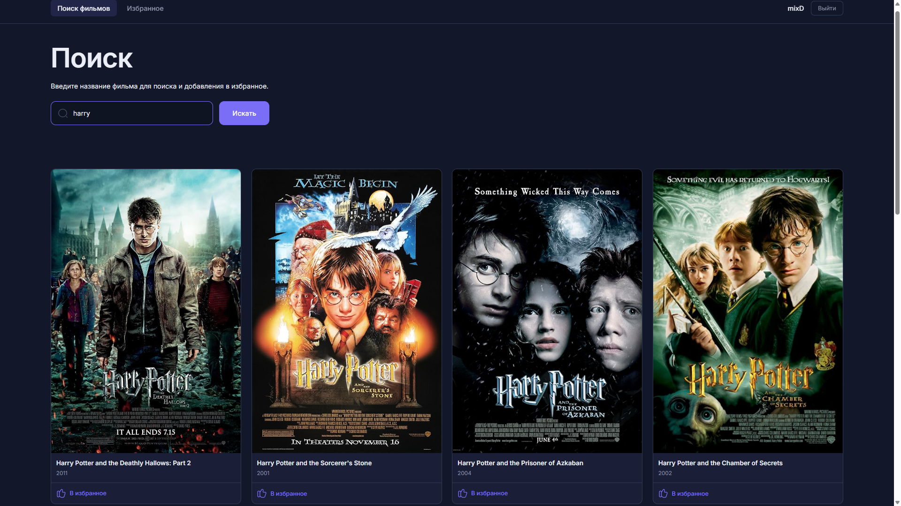

# 🎬 Movie Search

Одностраничное приложение для поиска фильмов с детальной информацией и добавлением в избранное.

🔗 **Демо:** [Перейти на сайт](https://mixd-movie-search.netlify.app/)



## Функциональность

- Поиск фильмов по названию через The Movie Database API
- Карточки фильмов с постерами, рейтингом и годом выпуска
- Детальная страница с полной информацией (жанры, описание, длительность)
- Добавление фильмов в избранное
- Динамическая маршрутизация
- Обработка всех состояний: загрузка, ошибка, пустой результат
- Адаптивная вёрстка под мобильные устройства и десктоп
- Чистая компонентная архитектура с разделением логики

## Технический стек

React, TypeScript, Redux Toolkit, React Router v6, Vite, CSS Modules, REST API, Деплой на Render

## Как запустить

1. Склонируй репозиторий:

   ```bash
   git clone https://github.com/mixDDDDD/movie-search.git

   ```

2. Перейди в папку:
   ```bash
   cd movie-search
   ```
3. Установи зависимости:
   ```bash
   npm install
   ```
4. Запусти dev-сервер:
   ```bash
      npm run dev
   ```
   Открой http://localhost:5173 в браузере.
